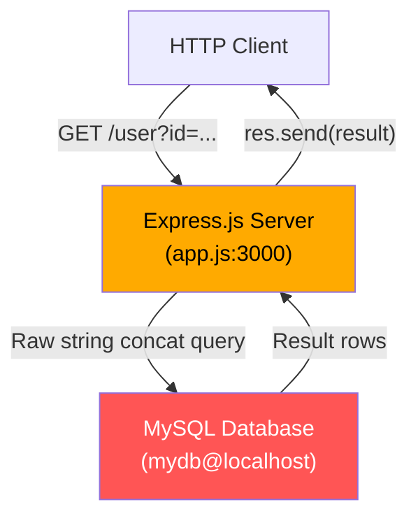

# sasidchjfhk/archon-e2e-test — Technical Security Review
**Report Date:** 2026-03-03 | **Triggered by:** @sasidchjfhk | **Prepared by:** Archon AI Security Engine

---

## Part 1: Codebase Documentation

### 1.1 Architecture Overview



### 1.2 Module Map

| Module | Purpose | Key Files | External Deps |
|--------|---------|-----------|---------------|
| HTTP Server | Handles inbound HTTP requests and routing | `app.js` | `express` |
| Database Layer | MySQL connection and query execution | `app.js` | `mysql` |

### 1.3 Function-Level Risk Register

| Function | File | Risk | Why |
|----------|------|------|-----|
| `app.get('/user', ...)` | `app.js:13` | **CRITICAL** | Accepts `req.query.id` directly from the HTTP request with no validation, sanitization, or parameterization, then concatenates it into a SQL query string |
| `mysql.createConnection(...)` | `app.js:6` | **HIGH** | Hardcoded plaintext credential in source code; the password is committed to version control and any reader of the file gains database access |
| `db.query(...)` | `app.js:16` | **CRITICAL** | Executes the tainted query string against the database; no error check before calling `res.send`, meaning raw DB errors may also leak schema information |

### 1.4 External Services

| Service | Auth Method | Data Sent | Risk |
|---------|------------|-----------|------|
| MySQL (`mydb@localhost`) | Hardcoded username `root` + plaintext password in source | Raw SQL queries including unsanitized user input; full result sets returned to caller | **CRITICAL** — root-level DB access with a credential exposed in source control; SQL injection can read, modify, or delete any data |

---

## Part 2: Security Investigation

### 2.1 Injection Risks

| Location | Type | Description | Severity |
|----------|------|-------------|----------|
| `app.js:15` | SQL Injection | `req.query.id` is concatenated directly into a SQL query string without parameterization or any escaping. An attacker can terminate the intended query and append arbitrary SQL. | CRITICAL |

### 2.2 Authentication & Authorization Issues

| Location | Type | Description | Severity |
|----------|------|-------------|----------|
| `app.js:13` | Missing authentication on sensitive endpoint | The `/user` endpoint returns database records with no authentication or authorization check. Any anonymous HTTP client can query any user record — or via SQLi, the entire database. | HIGH |

### 2.3 Sensitive Data Exposure

| Location | Type | Description | Severity |
|----------|------|-------------|----------|
| `app.js:17` | Unfiltered DB result returned to client | `res.send(result)` forwards the raw MySQL result object to the caller. Every column of every matched row — including potentially passwords, PII, or tokens — is sent verbatim. | HIGH |
| `app.js:16` | Unhandled DB error leaks schema info | `err` from `db.query` is never checked. If a malformed query or DB error occurs, `result` may be undefined, crashing the response or, depending on MySQL driver version, causing the error object (containing query text and schema details) to surface. | MEDIUM |

### 2.4 Hardcoded Secrets & Credential Exposure

| Location | Type | Description | Severity |
|----------|------|-------------|----------|
| `app.js:9` | Hardcoded database password | The string `"super_secret_password_123"` is embedded directly in source code. Any developer with repository read access, any leaked git history, any build artifact, or any container image layer exposes this credential permanently until rotated. The connection also runs as `root`, granting maximum database privilege. | HIGH |

### 2.5 Input Validation Gaps

| Location | Type | Description | Severity |
|----------|------|-------------|----------|
| `app.js:14` | No type or format validation on `id` parameter | `req.query.id` is a raw string with no check that it is a positive integer (or any integer). Non-numeric values will produce a SQL syntax error; malicious values enable full SQL injection. | CRITICAL (feeds 2.1) |

---

### 2.6 High-Risk Code — Ranked by Exploitability

**1. SQL Injection via `req.query.id`** — Severity: CRITICAL
- **Location:** `app.js:15`
- **Exploit Path:** `HTTP GET /user?id=<payload>` → `req.query.id` (raw string, no validation) → string concatenation `"SELECT * FROM users WHERE id = " + req.query.id` → `db.query(...)` executes against MySQL as `root`
- **Why This Causes the Problem:** Because the query is assembled by string concatenation, an attacker-supplied value such as `1 OR 1=1` changes the query's logical structure, returning all rows. A value like `1 UNION SELECT user,password,3 FROM mysql.user--` can extract the MySQL system credential table. Running as `root` means `INTO OUTFILE`, `LOAD DATA`, and stored procedure abuse are all within reach, potentially escalating to OS-level file write on misconfigured servers.
- **Confidence:** 99%

**2. Hardcoded Root Database Credential** — Severity: HIGH
- **Location:** `app.js:9`
- **Exploit Path:** Source file read (git clone, leaked artifact, insider) → plaintext password `super_secret_password_123` extracted → direct MySQL login as `root` from any host permitted by the MySQL `root` grant
- **Why This Causes the Problem:** Credentials in source are effectively public to anyone who can read the repository. Rotation is difficult because the fix requires a code change and redeploy. Using `root` compounds the issue — the attacker gains full DDL and DML access over every database on the server, not just `mydb`.
- **Confidence:** 99%

**3. Unauthenticated Endpoint Returning Raw DB Rows** — Severity: HIGH
- **Location:** `app.js:13–18`
- **Exploit Path:** Anonymous HTTP client → `GET /user?id=<any valid id>` → no auth middleware checked → `res.send(result)` returns all columns of matched row(s) to caller
- **Why This Causes the Problem:** Without an authentication check, any Internet-facing deployment exposes the entire `users` table to unauthenticated enumeration. Combined with the SQL injection finding above, a single unauthenticated attacker can exfiltrate the full database.
- **Confidence:** 97%

---

### 2.7 Remediation Plan

#### Fix 1: SQL Injection — Use Parameterized Queries

**Before:**
```javascript
app.get('/user', (req, res) => {
  const query = "SELECT * FROM users WHERE id = " + req.query.id;
  db.query(query, (err, result) => {
    res.send(result);
  });
});
```

**After:**
```javascript
app.get('/user', (req, res) => {
  const id = parseInt(req.query.id, 10);
  if (!Number.isInteger(id) || id <= 0) {
    return res.status(400).json({ error: 'Invalid id parameter' });
  }

  // Parameterized query — user input is never interpolated into SQL text
  const query = "SELECT id, username, email FROM users WHERE id = ?";
  db.query(query, [id], (err, result) => {
    if (err) {
      console.error('DB error:', err.code); // log code only, not full error
      return res.status(500).json({ error: 'Internal server error' });
    }
    if (!result || result.length === 0) {
      return res.status(404).json({ error: 'User not found' });
    }
    res.json(result[0]); // return single object, explicit columns only
  });
});
```

**Why this fix works:** The `?` placeholder causes the `mysql` driver to transmit the value as a bound parameter in the MySQL wire protocol, making it structurally impossible for user-supplied data to alter the query's parse tree.

---

#### Fix 2: Hardcoded Credential — Move to Environment Variables

**Before:**
```javascript
const db = mysql.createConnection({
  host: "localhost",
  user: "root",
  password: "super_secret_password_123",
  database: "mydb"
});
```

**After:**
```javascript
// Load from environment — never commit secrets to source control
// Provide via .env (local, gitignored), Docker secrets, or a secrets manager
const db = mysql.createConnection({
  host:     process.env.DB_HOST     || 'localhost',
  user:     process.env.DB_USER,           // no default — fail fast if unset
  password: process.env.DB_PASSWORD,
  database: process.env.DB_NAME    || 'mydb'
});

// Fail loudly at startup rather than silently connecting with undefined creds
if (!process.env.DB_USER || !process.env.DB_PASSWORD) {
  console.error('FATAL: DB_USER and DB_PASSWORD environment variables must be set');
  process.exit(1);
}
```

**Why this fix works:** Secrets never appear in source code or git history; the credential lifecycle is managed outside the codebase and can be rotated without a code change or redeploy.

> **Additional hardening:** Replace the `root` MySQL user with a least-privilege account that has only `SELECT` (and whatever else is required) on `mydb` — not `GRANT`, `FILE`, or global privileges.

---

#### Fix 3: Add Authentication Middleware to the `/user` Endpoint

**Before:**
```javascript
app.get('/user', (req, res) => {
  // no auth check
  ...
});
```

**After:**
```javascript
function requireAuth(req, res, next) {
  const token = req.headers['authorization']?.split(' ')[1];
  if (!token) {
    return res.status(401).json({ error: 'Authentication required' });
  }
  try {
    const payload = jwt.verify(token, process.env.JWT_SECRET);
    req.user = payload;
    next();
  } catch {
    return res.status(401).json({ error: 'Invalid or expired token' });
  }
}

app.get('/user', requireAuth, (req, res) => {
  // Only authenticated requests reach this handler
  ...
});
```

**Why this fix works:** Every request must present a cryptographically verifiable token before any database operation is attempted, eliminating unauthenticated enumeration and reducing the blast radius of any residual injection surface.

---

## Part 3: Code Quality & Resource Investigation

### 3.1 Resource Leak Analysis

| Location | Resource Type | Leak Scenario | Severity |
|----------|--------------|---------------|----------|
| `app.js:6–10` | MySQL connection | A single `createConnection` is used without connection pooling. If the connection drops (network blip, MySQL timeout), it is never re-established and all subsequent requests hang or error permanently until the process is restarted. | MEDIUM |

### 3.2 Memory Growth Risks

| Location | Pattern | Risk | Mitigation |
|----------|---------|------|-----------|
| `app.js:15–17` | Unbounded result set returned from `SELECT *` | A SQLi-augmented query (or a legitimately large table) can return thousands of rows, all buffered in memory before `res.send`. Under attack conditions this could exhaust heap. | Use `LIMIT` in the query; stream large result sets rather than buffering. |

### 3.3 Error Handling Gaps

| Location | Issue | Consequence |
|----------|-------|-------------|
| `app.js:16–18` | `err` from `db.query` is never checked | If a DB error occurs, `result` is `undefined`. `res.send(undefined)` sends an empty response body with no status code signal to the client. In some Express versions this may also trigger an unhandled exception that crashes the process. |
| `app.js:6` | No connection error handler | `db` connection errors (wrong password, host unreachable) are silently swallowed. The process continues running but every query will fail. Add `db.on('error', handler)` and handle `PROTOCOL_CONNECTION_LOST`. |

---

## Part 4: Recommendations

### 4.1 Immediate Actions (CRITICAL/HIGH — do this sprint)

1. **Replace string-concatenated SQL with a parameterized query** (`db.query("... WHERE id = ?", [id], ...)`) — eliminates the SQL injection finding entirely. See Fix 1 above.
2. **Remove the hardcoded password from `app.js`** and inject it via `process.env.DB_PASSWORD`. Rotate the `super_secret_password_123` credential immediately — treat it as compromised from the moment it was committed. See Fix 2 above.
3. **Replace the `root` MySQL user** with a least-privilege application account that holds only the permissions the app actually needs (e.g., `SELECT` on `mydb.users`).
4. **Add an authentication gate** to the `/user` endpoint so only verified users can query records. See Fix 3 above.
5. **Restrict the columns returned** — replace `SELECT *` with an explicit column list that excludes passwords, tokens, and internal fields.

### 4.2 Short-Term (MEDIUM — next 2–4 weeks)

1. **Switch from `mysql.createConnection` to `mysql.createPool`** to handle connection drops gracefully and support concurrent requests without exhausting a single socket.
2. **Add explicit error handling** in the `db.query` callback: check `err`, log only safe diagnostic info (error code, not message or query), and return a generic `500` to the client.
3. **Add an `.env.example` file** (with placeholder values, not real secrets) and add `.env` to `.gitignore` to enforce the environment-variable secret pattern for all developers.
4. **Add input validation middleware** (e.g., `express-validator`) to enforce type, range, and format constraints on all query parameters before they reach route handlers.
5. **Scan git history** for the now-rotated credential using a tool such as `git log -S "super_secret_password_123"` and consider rewriting history or treating the full history as potentially exposed.

### 4.3 Long-Term (Architecture — next quarter)

1. **Introduce a secrets management solution** (HashiCorp Vault, AWS Secrets Manager, or equivalent) so credentials are fetched at runtime and can be rotated without any code or config file change.
2. **Establish a security-focused code review checklist** that flags direct string interpolation into queries, hardcoded literals that look like credentials, and routes missing authentication middleware — blocking these patterns before merge.
3. **Add a SAST step to CI/CD** (e.g., Semgrep with the `nodejs` and `sql-injection` rulesets) so injection and secret-hardcoding findings are caught automatically on every pull request.
4. **Define a response schema** for every API endpoint so the serialization layer can enforce which fields are permitted in the response, preventing accidental data leakage from `SELECT *` or schema changes.

---
*Report generated by Archon AI Security Engine. Review all findings before acting — AI analysis may have false positives.*